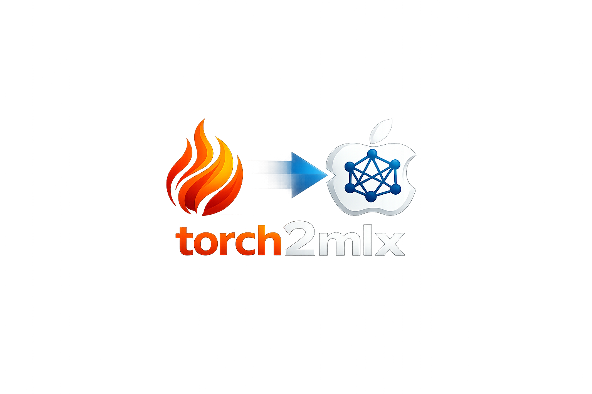

<p align="center">
  
</p>

<p align="center">
  Translate PyTorch neural network models to Apple's MLX framework.
</p>

> **Scope**: torch2mlx converts models for **inference** on Apple Silicon. Training support (including a Lightning-compatible MLX Trainer) is on the roadmap.

## Why

PyTorch models don't run natively on Apple Silicon's GPU/Neural Engine. [MLX](https://github.com/ml-explore/mlx) does — but porting a model means manually transposing weight layouts, renaming state dict keys, rewriting `forward()` calls, and debugging silent numerical mismatches.

**torch2mlx** automates the mechanical parts:

- **Weight conversion** — dispatches the correct transposition per layer type (Conv2d needs `[O,I,H,W]` → `[O,H,W,I]`, Linear is identity, etc.)
- **State dict surgery** — converts PyTorch's flat dot-separated keys to MLX's nested dicts, through safetensors as the interchange format
- **Portability analysis** — tells you _before_ you start porting what percentage of the model converts automatically and what needs manual work
- **MLX templates** — hand-written reference implementations for common patterns (transformer blocks, conv stacks, MLPs)

## Quickstart

```bash
pip install torch2mlx          # core (numpy + safetensors only)
pip install torch2mlx[all]     # with torch + mlx + dev tools
```

### Python API

```python
import torch2mlx

# Analyze portability before converting
report = torch2mlx.analyze(model)
print(f"Coverage: {report.coverage:.0%}")

# Convert a PyTorch model → safetensors
torch2mlx.convert(model, "weights.safetensors")

# Load into MLX
params = torch2mlx.load_converted("weights.safetensors")
mlx_model.load_weights(list(params.items()))
```

### CLI

```bash
# Convert with portability report
python -m torch2mlx model.pt output/

# Analyze only (no conversion)
python -m torch2mlx model.pt --analyze-only
```

You can also pass a pre-extracted state dict (numpy arrays with dot-separated keys) instead of a live `torch.nn.Module` — no torch installation required for the conversion step itself.

## How it works

torch2mlx walks the PyTorch module tree, looks up each layer in a **registry** to find its MLX equivalent and weight transposition rule, applies the transpositions using **numpy only** (no framework imports during conversion), and saves the result as safetensors. A separate **analyzer** inspects the model's `forward()` source for non-convertible patterns (in-place mutation, custom autograd, etc.) and reports blockers before you invest time porting.

```
src/torch2mlx/
├── registry.py          # torch.nn.X → mlx.nn.X dispatch table
├── op_mapping.py        # torch.cat → mx.concatenate etc. + dtype mappings
├── weight_converter.py  # Per-layer transposition rules (numpy only)
├── state_dict.py        # Flat keys ↔ nested dict + safetensors I/O
├── analyzer.py          # Portability report: % convertible, blockers
├── converter.py         # End-to-end orchestration
└── templates/           # Hand-written MLX module implementations
```

## What's supported

**37** layer types, **30** ops, **12** dtype mappings, **6** weight transposition rules — covering Linear, Conv1d/2d, ConvTranspose1d/2d, BatchNorm, LayerNorm, RMSNorm, Embedding, MultiheadAttention, GroupNorm, InstanceNorm, pooling (MaxPool/AvgPool 1d/2d/3d, AdaptiveAvgPool2d), Transformer encoder/decoder, common activations (GELU, ReLU, SiLU, Tanh, Sigmoid, LeakyReLU, Softmax), and tensor ops (einsum, matmul, reshape, squeeze/unsqueeze, reductions, etc.).

Works with `torch.compile()` — compiled models convert identically to uncompiled ones.

See [docs/support-matrix.md](docs/support-matrix.md) for the full table.

**Not supported** (architectural blockers): RNNs/LSTMs (stateful, out of scope), Conv3d (MLX lacks it), in-place mutation patterns (`+=`, `.copy_()` — MLX arrays are immutable).

## Numerical equivalence

Three end-to-end validation examples in `examples/` prove that converted models produce identical outputs:

| Example | Architecture | Max logit diff | MLX speedup |
|---|---|---|---|
| [`validate_mnist.py`](examples/validate_mnist.py) | CNN (Conv2d, MaxPool2d, Linear) | < 1e-5 | ~3x |
| [`validate_transformer.py`](examples/validate_transformer.py) | Transformer (Attention, FFN, LayerNorm) | < 1e-5 | ~2x |
| [`validate_resnet.py`](examples/validate_resnet.py) | ResNet (Conv2d, BatchNorm, skip connections) | < 1e-5 | ~6x |

Each script trains a small model in PyTorch, converts via torch2mlx, loads into an equivalent MLX model, and compares predictions — 100% agreement across all three.

## Templates

Hand-written MLX implementations for common architecture patterns:

| Template | Description |
|---|---|
| `MLP` | Linear stacks with configurable activation, dropout, residual connections |
| `TransformerBlock` | Self-attention + FFN + LayerNorm (pre-norm and post-norm) |
| `ConvBlock` | Conv + normalization + activation |
| `ConvStack` | Stacked ConvBlocks with channel progression |
| `AdaptiveAvgPool2d` | Dynamic kernel/stride computation for adaptive average pooling |

These are reference implementations, not auto-generated. Use them directly or as a starting point for hand-porting custom architectures.

## Roadmap

torch2mlx currently targets **inference-only** conversion of feed-forward architectures.

**Training support** is planned via a Lightning-compatible MLX Trainer — users would provide an MLX-native `forward()` while weights, optimizers, schedulers, and the training loop are automated. 

## Development

```bash
pip install -e ".[all]"          # Install with torch + mlx + dev deps
python -m pytest                 # Run tests (238 tests)
ruff check src/                  # Lint
ruff format src/ tests/          # Format
```

## License

Apache 2.0
